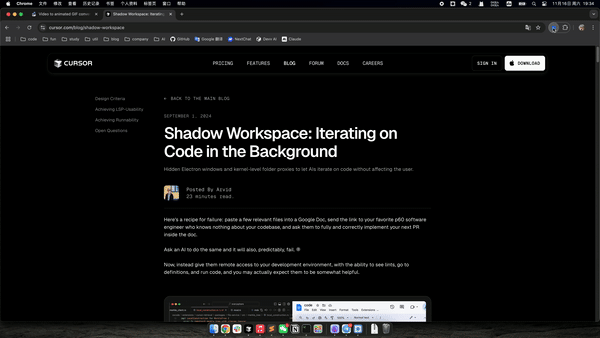

# AI Webpage Assistant

一个强大的 Chrome 扩展，可以让你与当前网页内容进行智能对话。通过 OpenAI API 提供支持，帮助你快速理解和分析网页内容。

## 演示

## 功能特点

- 🎯 智能侧边栏：优雅的聊天界面，随时可以打开/关闭
- 💬 上下文感知：AI 助手了解当前网页内容，可以回答相关问题
- 📝 一键总结：快速获取网页内容的 Markdown 格式摘要
- 💾 历史记录：自动保存聊天记录，支持一键清除当天记录
- ⚡️ 快捷操作：支持自定义常用 Prompt，提高使用效率
- ⚙️ 灵活配置：支持自定义 API Key 和模型选择
- 🎨 现代界面：简洁优雅的 UI 设计，支持 Markdown 渲染
- 🔒 安全可靠：本地处理数据，保护用户隐私

## 安装说明

1. 下载项目代码
2. 打开 Chrome 浏览器，进入扩展管理页面 (`chrome://extensions/`)
3. 开启"开发者模式"
4. 点击"加载已解压的扩展程序"
5. 选择项目文件夹

## 使用方法

1. 配置设置
   - 点击扩展图标
   - 点击"设置"按钮
   - 输入你的 OpenAI API Key
   - 选择想要使用的模型
   - 添加常用的 Prompt（可选）

2. 开始使用
   - 在任意网页点击扩展图标打开侧边栏
   - 使用"总结网页"快捷按钮获取页面摘要
   - 使用自定义 Prompt 快速提问
   - 或直接输入问题进行对话
   - 支持 Shift + Enter 换行
   - Enter 直接发送消息

3. 历史记录管理
   - 聊天记录自动保存
   - 点击"清除记录"可删除当天的聊天记录
   - 历史记录会在重新打开时自动加载
